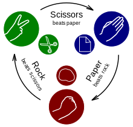

# The Odin Prject Rock, Paper, Scissors

Rock, paper, scissors (also known as Rochambeau, Roshambo, or Janken) is a fun and easy hand game that anyone can learn and enjoy. It’s a great way to make minor decisions when you and a friend can’t agree on something, or even just an entertaining way to pass the time. 

This Project focus on writing a simple digital version of the game using HTML, CSS and JAVASCIPT. This digital version is play between a computer and a user and all the rules are apply as the tridation version. 

The rules are 
# ROCK beats SCISSORS and loses to PAPER
# PAPER beats ROCK and loses to SCISSOR
# SCISSOR beats PAPER but loses to ROCK

# FEATURES
This game consist of a GUI that has the following components: 
# Players Name
This display the username of the players
# Score Keeper
This display the score of each players
# Number of Rolls
This display the amount of roll a player has left
# Turn Indicator
Tells which player is currently rolling 
# Player choice
Display the choice of each player in a round
# Round Counter
Display the current number of round
# Round Winner Message
Display the winner of round
# Rock Button 
Allow user to select rock
# Paper Button 
Allow user to select paper
# Scissor Button
allow user to select scissor
# Restart button 
Restarts the game
# End Button 
End the game
# New Button
creates a new game

# Responsiveness
This game is responive. It can be play in the browser on mobile (Landscape & Protrait). 

# Owner and Designer
This game was develop by Edwin Saah Kainah as project for The Odin Project. It was build in two pharses. Pharse one focus on the user interaction and logic of the game. Pharse focus on the designing of the GUI and the connecting features using DOM in JavaScript. 

# Date of Creation 
This project started on Jan. 26, 2024
